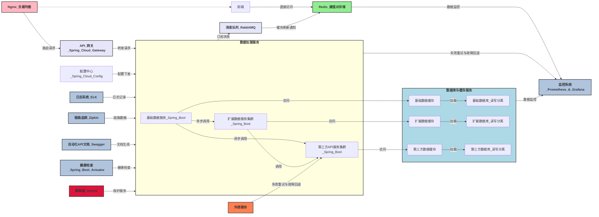

```mermaid
graph LR
   style LB fill:#FFB6C1,stroke:#333,stroke-width:2px,font-weight:bold
   style REDIS fill:#90EE90,stroke:#333,stroke-width:2px,font-weight:bold
   style GW fill:#E6E6FA,stroke:#333,stroke-width:2px,font-weight:bold
   style DATA_SERVICES fill:#FFFFE0,stroke:#333,stroke-width:2px,font-weight:bold
   style DATABASE_SERVICES fill:#ADD8E6,stroke:#333,stroke-width:2px,font-weight:bold
   style MQ fill:#E6E6FA,stroke:#333,stroke-width:2px,font-weight:bold
   style MON fill:#B0C4DE,stroke:#333,stroke-width:2px,font-weight:bold
   style LOG fill:#B0C4DE,stroke:#333,stroke-width:2px,font-weight:bold
   style TRACE fill:#B0C4DE,stroke:#333,stroke-width:2px,font-weight:bold
   style DOC fill:#B0C4DE,stroke:#333,stroke-width:2px,font-weight:bold
   style HC fill:#B0C4DE,stroke:#333,stroke-width:2px,font-weight:bold
   style CB fill:#DC143C,stroke:#333,stroke-width:2px,font-weight:bold
   style EXT fill:#FF7F50,stroke:#333,stroke-width:2px,font-weight:bold
   subgraph DATABASE_SERVICES[数据库与缓存服务]
      direction TB
      BDSDB[基础数据库_读写分离]
      BDSC[基础数据缓存]
      EDSDB[扩展数据库_读写分离]
      EDSCACHE[扩展数据缓存]
      TPSDB[第三方数据库_读写分离]
      TPSCACHE[第三方数据缓存]
   end
   subgraph DATA_SERVICES[数据处理服务]
      direction TB
      BDS[基础数据服务_Spring_Boot]
      EDSC[扩展数据服务集群_Spring_Boot]
      TPSC[第三方API服务集群_Spring_Boot]
   end
   LB[Nginx_负载均衡]
   REDIS[Redis_键值对存储]
   GW[API_网关_Spring_Cloud_Gateway]
   FE[前端]
   CM[配置中心_Spring_Cloud_Config]
   MQ[消息队列_RabbitMQ]
   MON[监控系统_Prometheus_&_Grafana]
   LOG[日志系统_ELK]
   TRACE[链路追踪_Zipkin]
   DOC[自动化API文档_Swagger]
   HC[健康检查_Spring_Boot_Actuator]
   CB[断路器_Hystrix]
   EXT[外部服务]
   LB -.-> FE
   LB -->|路由请求| GW
   GW -->|转发请求| DATA_SERVICES
   FE -->|直接访问| REDIS
   CM -->|配置下发| DATA_SERVICES
   DATA_SERVICES -->|订阅消息| MQ
   MQ -->|缓存刷新通知| REDIS
   DATA_SERVICES -->|失败重试与故障回退| MON
   REDIS -->|数据监控| MON
   LOG -->|日志记录| DATA_SERVICES
   TRACE -->|链路数据| DATA_SERVICES
   DOC -->|文档生成| DATA_SERVICES
   HC -->|健康检查| DATA_SERVICES
   DATABASE_SERVICES -->|数据监控| MON
   CB -->|保护服务| DATA_SERVICES
   BDS -->|异步调用| EDSC
   BDS -->|异步调用| TPSC
   BDS -->|访问| BDSC
   BDSC -->|加载| BDSDB
   EDSC -->|访问| EDSCACHE
   EDSCACHE -->|加载| EDSDB
   TPSC -->|访问| TPSCACHE
   TPSCACHE -->|加载| TPSDB
   EDSC -->|调用| TPSC
   EXT -->|失败重试与故障回退| TPSC
```
